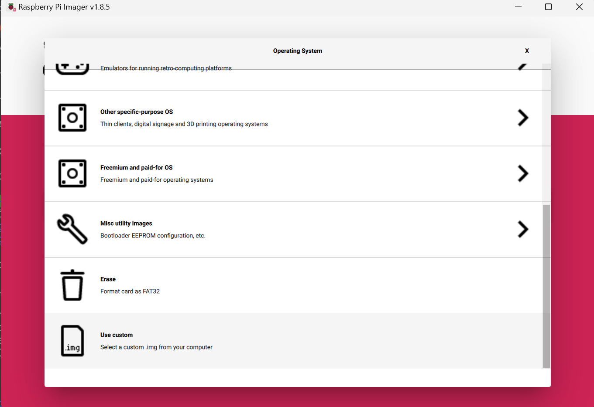
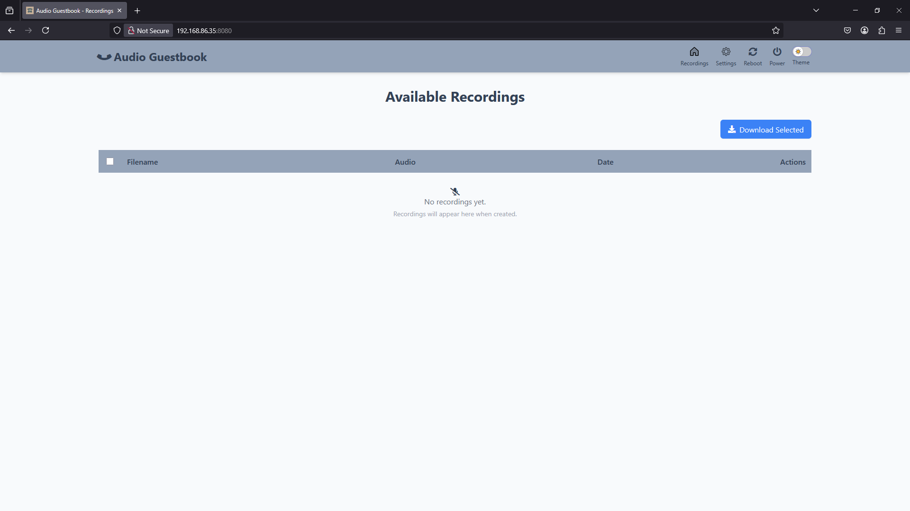
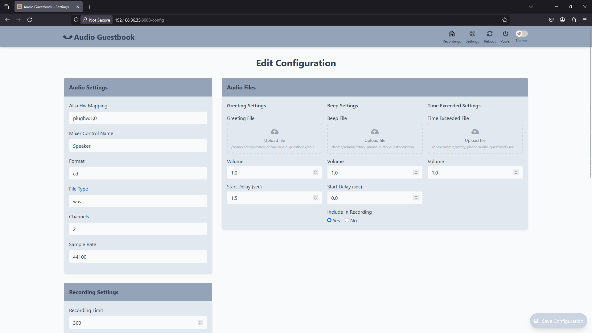

# Rotary Phone Audio Guestbook

This project transforms a rotary phone into a voice recorder for special events such as a wedding audio guestbook.


- [Rotary Phone Audio Guestbook](#rotary-phone-audio-guestbook)
  - [Background](#background)
  - [Materials](#materials)
  - [Setup](#setup)
    - [Prepare Your Rotary Phone](#prepare-your-rotary-phone)
    - [Download and Install the Custom Image](#download-and-install-the-custom-image)
    - [Initial Configuration](#initial-configuration)
  - [Software](#software)
  - [Development](#development)
  - [Support](#support)
  - [Star History](#star-history)

## Background

Inspired by my upcoming wedding, I created a DIY audio guestbook using a rotary phone. After finding that commercial rentals charged high fees without offering custom voicemail options, I developed this affordable and customizable solution. This guide will help you create your own audio guestbook.

## [Materials](docs/materials.md)

## Setup

### Prepare Your Rotary Phone

1. Follow the [Hardware](docs/hardware.md) section for detailed instructions on wiring your rotary phone to the Raspberry Pi.

_Note: This is a crucial first step before proceeding to software installation._

### Download and Install the Custom Image

With your hardware prepared, install the custom Raspberry Pi image that contains all necessary software:

1. Download the [latest release](https://github.com/nickpourazima/rotary-phone-audio-guestbook/releases)
2. Extract the .gz file: `gunzip rpizero_rotary_phone_audio_guestbook_v<latest>_imagebackup.img.gz`
3. Flash the image to an SD card using Raspberry Pi Imager or BalenaEtcher:

   

4. Configure the following credentials when prompted:
   ```bash
   username: admin
   password: password
   ```
5. Set up your WiFi network connection
6. Insert the SD card into your Raspberry Pi and power it on

### Initial Configuration

Once you've completed the hardware setup and installed the image:

1. Boot up your Raspberry Pi and allow it a minute to initialize
2. Navigate to `<RPI_IP>:8080` in a web browser to access the control interface:

   

3. Visit the Settings page to customize your configuration:

   

Your audio guest book is now ready for test/deployment! For advanced configuration options and detailed explanations of all settings, refer to the [Configuration](docs/configuration.md) documentation.

## [Software](docs/software.md)

## [Development](docs/development.md)

## Support

It's great to see this project growing. Special thanks to @svartis, @jmdevita, and @Mevel!

If this code helped you or if you have feedback, I'd be happy to [hear about it](mailto:dillpicholas@duck.com)!
Feel like saying thanks? You can [buy me a coffee](https://ko-fi.com/dillpicholas)☕.

## Star History

<a href="https://star-history.com/#nickpourazima/rotary-phone-audio-guestbook&Date">
 <picture>
   <source media="(prefers-color-scheme: dark)" srcset="https://api.star-history.com/svg?repos=nickpourazima/rotary-phone-audio-guestbook&type=Date&theme=dark" />
   <source media="(prefers-color-scheme: light)" srcset="https://api.star-history.com/svg?repos=nickpourazima/rotary-phone-audio-guestbook&type=Date" />
   
 </picture>
</a>
