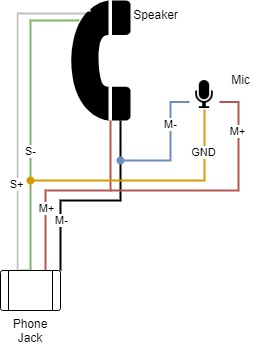

# Rotary Phone Audio Guestbook

This project transforms a rotary phone into a voice recorder for use at special events (i.e. wedding audio guestbook, etc.).

- [Rotary Phone Audio Guestbook](#rotary-phone-audio-guestbook)
  - [Background](#background)
  - [Post-Event](#post-event)
    - [Future Potential](#future-potential)
  - [Materials](#materials)
  - [Setup](#setup)
    - [Hardware](#hardware)
      - [Wiring](#wiring)
      - [Microphone Replacement (Optional)](#microphone-replacement-optional)
    - [Software](#software)
      - [Dev Environment](#dev-environment)
      - [Dependencies](#dependencies)
      - [AudioInterface Class](#audiointerface-class)
      - [rotaryGuestBook.service](#rotaryguestbookservice)
      - [Operation Mode 1: rotaryGuestBook](#operation-mode-1-rotaryguestbook)
      - [Operation Mode 2: rotaryGuestBookwithRotaryDialer](#operation-mode-2-rotaryguestbookwithrotarydialer)

## Background

I was inspired by my own upcoming wedding to put together a DIY solution for an audio guestbook using a rotary phone. Most online rentals were charging $600 for an experience that didn't even offer the ability to add a custom voice mail and took about 4-6 weeks of turn around time to process the audio after the event. I tried to use as many parts that I had laying around to keep costs down. It worked out quite well and we were able to gather some very special voice messages.

Below you will find a parts list and detailed setup guide. Please feel free to reach out to me with any questions.

## Post-Event

Since this was a trial by fire type of scenario there ended up being a few gotchas at the real event which I've since accounted for. Namely setting a time limit on the recording length as we had some youngsters leaving 5+ minute messages repeatedly and this ended up draining the battery.

### Future Potential

A few weeks before the wedding I had the code registering dialed numbers from the rotary encoder with the goal of playing back special messages for certain guests who dialed a certain combination (i.e. dial an area code to hear a special message to my old roomates). The details of this operation mode are described in Mode 2 below. In order to activate this mode I had to wait for input when the phone was off the hook. This required an extra step of dialing zero before leaving a normal voice message. In the end we decided to keep it simple and I've thus migrated this code to the dev branch along with the code to run through post-porcessing the audio in a separate process.
If any one is interested in expanding this please feel free.

## Materials

| Part|Notes|Quantity|Cost|
| - | - | - | - |
| [rotary phone](https://www.ebay.com/b/Rotary-Dial-Telephone/38038/bn_55192308) | Estate/garage/yard sales are probably the best places to find once of these. Ideally one with a phone jack since we will be using these four wires extensively. | 1 | $0.00-$60.00 |
| [raspberry pi zero](https://www.raspberrypi.com/products/raspberry-pi-zero/) | I didn't realize how hard these are to find these days. You can use any rpi or arduino style single-board computer but be aware of size constraints (i.e. must fit inside the rotary phone enclosure) | 1 | $9.99 |
| [raspberry pi zero case](https://www.adafruit.com/product/3252) | Optional: added for protection. One of the cases on Amazon has a heat-sink cutout which might be nice for better heat dissapation since it will all be enclosed in the end. | 1 | $4.95 |
| [micro SD card](https://a.co/d/1gb2zhC) | Any high capacity/throughput micro SD card that is rpi compatible | 1 | $8.99 |
| [USB Audio Adapter](https://www.adafruit.com/product/1475) | Note: I removed the external plastic shell and directly soldered the wires instead of using the female 3.5mm receptacle. | 1 | $4.95 |
| [USB OTG Host Cable - MicroB OTG male to A female](https://www.adafruit.com/product/1099) | | 1 | $2.50 |
| --- | **--- If running off a battery ---** | --- | --- |
| [LiPo Battery](https://www.adafruit.com/product/2011)| Optional: maximize capacity based on what will fit within your rotary enclosure. |1| $12.50 |
| [LiPo Shim](https://www.adafruit.com/product/3196)| Optional: if you plan to run this off a LiPo I would recommend something like this to interface with the rpi zero. |1| $9.95 |
| [LiPo Charger](https://www.adafruit.com/product/1904) | Optional: for re-charging the LiPo. |1| $6.95 |
| --- | **--- If replacing the built-it microphone ---** | --- | --- |
| [LavMic](https://www.amazon.com/dp/B01N6P80OQ?ref=nb_sb_ss_w_as-reorder-t1_ypp_rep_k3_1_9&amp=&crid=15WZEWMZ17EM9&amp=&sprefix=saramonic) | Optional: if you'd like to replace the carbon microphone. This is an omnidirectional lavalier mic and outputs via a 3.5mm TRS | 1 | $24.95 |

## Setup

### Hardware

#### Wiring

#### Microphone Replacement (Optional)

I found the sound quality of the built-in [carbon microphone](https://en.wikipedia.org/wiki/Carbon_microphone) on the rotary phone to be quite lacking in terms of amplitude, dynamic range and overall vocal quality. I tried boosting the gain from the digital (ALSA driver) side but this introduced an incredible amount of noise as expected. I then approached this from the analog domain and tried alternative circuitry to boost the sound quality based off this [carbon-to-dynamic converter](https://www.circuits-diy.com/mic-converter-circuit/).

Might be worth a further investigation in the future since it retains the integrity of the original rotary phone.

My final attempt involved the introduction of some post-proceesing (see dev branch) to bandpass some of the freqs outside the speech domain and add some normalization. The processing was costly in terms of processing and power consumption/rendering time and I ultimately decided it was worth acquiring something that yielded a better capture right out the gate. Crap in, crap out - as they say in the sound recording industry.

To replace:

- Unscrew mouthpiece and remove the carbon mic
- Pop out the plastic terminal housing with the two metal leads
- Unscrew red and black wires from terminal

### Software

#### Dev Environment

- rpi image: [Rasbian](https://www.raspberrypi.com/documentation/computers/getting-started.html) w/ SSH enabled
- rpi on same network as development machine
- Desktop IDE: vscode w/ [SSH FS extension](https://marketplace.visualstudio.com/items?itemName=Kelvin.vscode-sshfs)

[Here's](https://jayproulx.medium.com/headless-raspberry-pi-zero-w-setup-with-ssh-and-wi-fi-8ddd8c4d2742) a great guide to get the rpi setup headless w/ SSH & WiFi dialed in.

#### Dependencies

- `pip3 install -r requirements.txt` or pip install each manually:
  - [GPIOZero](https://gpiozero.readthedocs.io)
  - [Pydub](http://pydub.com/)
  - [PyAudio](https://people.csail.mit.edu/hubert/pyaudio/)
  - [PyYAML](https://pyyaml.org/)

#### [AudioInterface Class](audioInterface.py)

#### [rotaryGuestBook.service](rotaryGuestBook.service)

This service starts the python script on boot. Place it in the `/etc/systemd/system` directory.

`systemctl enable audioGuestBook.service`
`systemctl start audioGuestBook.service`

#### Operation Mode 1: [rotaryGuestBook](rotaryGuestBook.py)

#### Operation Mode 2: [rotaryGuestBookwithRotaryDialer](rotaryGuestBookwithRotaryDialer.py)

***Note*:** Untested - decided not to go this route for my own wedding

- This mode is a special modification of the normal operation and requires a slightly different wiring connection since it accepts input from the rotary dialer.
- The idea was to playback special messages when particular users dial a certain number combination (i.e. 909 would play back a message for certain guests who lived with the groom in that area code).
- In this mode of operation the users will need to dial 0 on the rotary dialer in order to initiate the voicemail.
