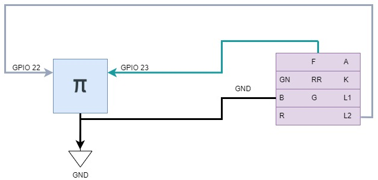
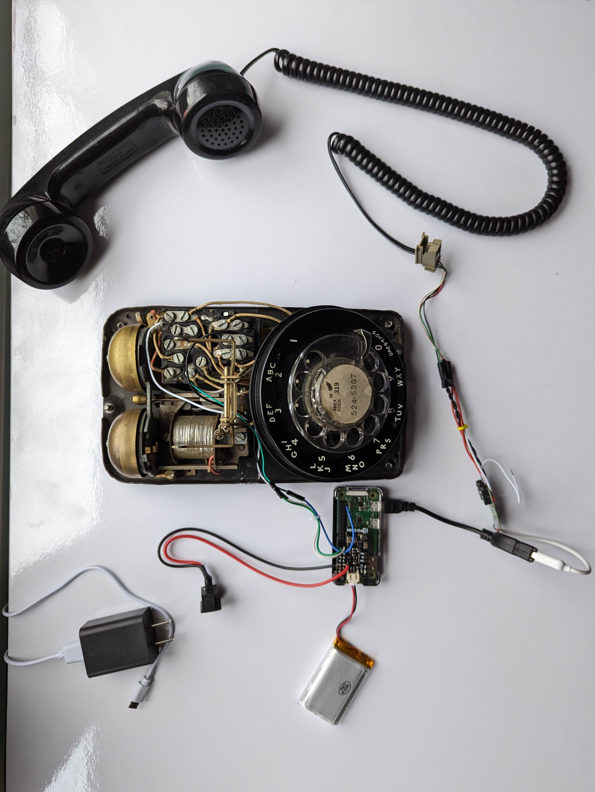
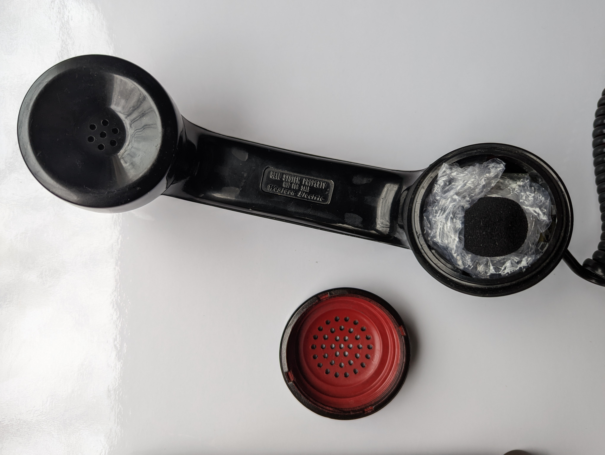

# Rotary Phone Audio Guestbook

This project transforms a rotary phone into a voice recorder for use at special events (i.e. wedding audio guestbook, etc.).


- [Rotary Phone Audio Guestbook](#rotary-phone-audio-guestbook)
  - [Background](#background)
  - [Materials](#materials)
  - [Setup](#setup)
    - [Prepare Your Rotary Phone](#prepare-your-rotary-phone)
    - [Download and Install the Custom Image](#download-and-install-the-custom-image)
    - [Configuration and Customization](#configuration-and-customization)
  - [Hardware](#hardware)
    - [Wiring](#wiring)
      - [Hook](#hook)
      - [Phone Cord](#phone-cord)
    - [Optional: Microphone Replacement](#optional-microphone-replacement)
  - [Software](#software)
    - [audioInterface](#audiointerface)
    - [audioGuestBook](#audioguestbook)
    - [Web Server](#web-server)
    - [Contributing](#contributing)
      - [Development Setup](#development-setup)
        - [Tailwind CSS Setup](#tailwind-css-setup)
        - [Syncing Files with Raspberry Pi](#syncing-files-with-raspberry-pi)
        - [Starting the Web Server in Development Mode](#starting-the-web-server-in-development-mode)
        - [Python dependencies](#python-dependencies)
      - [Generating an img for a release](#generating-an-img-for-a-release)
      - [Debugging](#debugging)
  - [Support](#support)
  - [Star History](#star-history)

## Background

Inspired by my own upcoming wedding, I created a DIY solution for an audio guestbook using a rotary phone. With most online rentals charging exorbitant fees without offering custom voicemail options, I sought a more affordable and customizable solution. Here, I've detailed a guide on creating your own audio guestbook. If you have questions, don't hesitate to reach out.

## Materials

<details>
  <summary>Parts List</summary>

| Part                                                                                                                                                                                                                                                                                                                                      | Notes                                                                                                                                                                                                 | Quantity | Cost         |
| ----------------------------------------------------------------------------------------------------------------------------------------------------------------------------------------------------------------------------------------------------------------------------------------------------------------------------------------- | ----------------------------------------------------------------------------------------------------------------------------------------------------------------------------------------------------- | -------- | ------------ |
| [rotary phone](https://www.ebay.com/b/Rotary-Dial-Telephone/38038/bn_55192308)                                                                                                                                                                                                                                                            | Estate/garage/yard sales are probably the best places to find once of these. Ideally one with a phone jack since we will be using these four wires extensively.                                       | 1        | $0.00-$60.00 |
| [raspberry pi zero](https://www.raspberrypi.com/products/raspberry-pi-zero/)                                                                                                                                                                                                                                                              | I didn't realize how hard these are to find these days. You can use any rpi or arduino style single-board computer but be aware of size constraints (i.e. must fit inside the rotary phone enclosure) | 1        | $9.99        |
| [raspberry pi zero case](https://www.adafruit.com/product/3252)                                                                                                                                                                                                                                                                           | Optional: added for protection. One of the cases on Amazon has a heat-sink cutout which might be nice for better heat dissapation since it will all be enclosed in the end.                           | 1        | $4.95        |
| [micro SD card](https://a.co/d/1gb2zhC)                                                                                                                                                                                                                                                                                                   | Any high capacity/throughput micro SD card that is rpi compatible                                                                                                                                     | 1        | $8.99        |
| [USB Audio Adapter](https://www.adafruit.com/product/1475)                                                                                                                                                                                                                                                                                | Note: I removed the external plastic shell and directly soldered the wires instead of using the female 3.5mm receptacle.                                                                              | 1        | $4.95        |
| [USB OTG Host Cable - MicroB OTG male to A female](https://www.adafruit.com/product/1099)                                                                                                                                                                                                                                                 |                                                                                                                                                                                                       | 1        | $2.50        |
| ---                                                                                                                                                                                                                                                                                                                                       | **--- If you don't want to solder anything ---**                                                                                                                                                      | ---      | ---          |
| [3.5mm Male to Screw Terminal Connector](https://www.parts-express.com/3.5mm-Male-to-Screw-Terminal-Connector-090-110?quantity=1&utm_source=google&utm_medium=cpc&utm_campaign=18395892906&utm_content=145242146127&gadid=623430178298&gclid=CjwKCAiAioifBhAXEiwApzCztl7aVb18WP4hDxnlQUCHsb62oIcnduFCSCbn9LFkZovYTQdr6omb3RoCD_gQAvD_BwE) | Optional: can connect the handset cables directly to the USB audio interface via these screw terminals                                                                                                | 2        | $1.37        |
| ---                                                                                                                                                                                                                                                                                                                                       | **--- If running off a battery ---**                                                                                                                                                                  | ---      | ---          |
| [LiPo Battery](https://www.adafruit.com/product/2011)                                                                                                                                                                                                                                                                                     | Optional: maximize capacity based on what will fit within your rotary enclosure.                                                                                                                      | 1        | $12.50       |
| [LiPo Shim](https://www.adafruit.com/product/3196)                                                                                                                                                                                                                                                                                        | Optional: if you plan to run this off a LiPo I would recommend something like this to interface with the rpi zero.                                                                                    | 1        | $9.95        |
| [LiPo Charger](https://www.adafruit.com/product/1904)                                                                                                                                                                                                                                                                                     | Optional: for re-charging the LiPo.                                                                                                                                                                   | 1        | $6.95        |
| ---                                                                                                                                                                                                                                                                                                                                       | **--- If replacing the built-it microphone ---**                                                                                                                                                      | ---      | ---          |
| [LavMic](https://www.amazon.com/dp/B01N6P80OQ?ref=nb_sb_ss_w_as-reorder-t1_ypp_rep_k3_1_9&amp=&crid=15WZEWMZ17EM9&amp=&sprefix=saramonic)                                                                                                                                                                                                 | Optional: if you'd like to replace the carbon microphone. This is an omnidirectional lavalier mic and outputs via a 3.5mm TRS                                                                         | 1        | $24.95       |

</details>

## Setup

### Prepare Your Rotary Phone

- Follow the [Hardware](#hardware) section for detailed instructions on wiring your rotary phone to the Raspberry Pi.

_Note: This is a crucial first step before using the software._

### Download and Install the Custom Image

With your hardware ready, download the custom Raspberry Pi image provided, which has all necessary software pre-installed and pre-configured.

- Download the [latest release](https://github.com/nickpourazima/rotary-phone-audio-guestbook/releases)
- Extract the .gz file, i.e.: `gunzip rpizero_rotary_phone_audio_guestbook_v<latest>_imagebackup.img.gz`
- **Flash the Image to an SD Card**: Use a tool like the Raspberry Pi Imager or BalenaEtcher to flash the custom image onto your SD card:

  - 
  - Customize the config to specify the following username/password:

  ```bash
    username: admin
    password: password
  ```

  - and set up your wifi network accordingly

- **Insert and Boot**: Place the SD card into your Raspberry Pi and power it on to boot into the Rotary Phone Audio Guestbook.

### Configuration and Customization

Once your system is up and running, you will want to make adjustments to suit your specific setup, especially if your hardware differs or you have personal preferences for how the guestbook operates.

- [ ] Replace the voicemail.wav with your own custom recording
- [ ] Check your ALSA HW mapping

  Depending on your audio interface's configuration, you may need to adjust the ALSA settings further. If after running `aplay -l` you find that the ALSA hardware mapping differs from what is expected or if you're experiencing audio issues, consider modifying `.asoundrc` to ensure your device correctly identifies and uses your audio interface. For example, if your USB audio interface is listed as card 1, device 0, you might add or modify `.asoundrc` to include:

  ```bash
  pcm.!default {
      type hw
      card 1
  }

  ctl.!default {
      type hw
      card 1
  }
  ```

- [ ] Adjust the `config.yaml`

  This file allows you to customize your own set up (edit rpi GPIO pins, alsa mapping, etc), modify the yaml as necessary.

  - `alsa_hw_mapping`: The ALSA hardware mapping for your audio interface. Use aplay --help for format guidance.
  - `format`: Set the audio format (default is cd). Refer to aplay --help for options.
  - `file_type`: The type of file to save recordings as (default is wav).
  - `channels`: Number of audio channels (default is 2 for stereo).
  - `hook_gpio`: The GPIO pin connected to the phone's hook switch.
    - For GPIO mapping, refer to the wiring diagram specific to your rpi:
    - 
  - `hook_type`: Set to NC (Normally Closed) or NO (Normally Open), depending on your phone's hook switch hardware setup.
  - `recording_limit`: The maximum length for a recording in seconds (default is 300).
  - `sample_rate`: The sample rate for recordings (default is 44100 Hz).

  _Note: Adjust these settings as needed based on your specific hardware setup and preferences._

- [ ] Test audio playback/recording

To ensure your settings are correctly applied, you can test audio playback and recording after making changes. For playback, you can use a sample WAV file and the `aplay` command. For recording, `arecord` can be used followed by `aplay` to play back the recorded audio.

- [ ] Check [audioGuestBook systemctl service](audioGuestBook.service)

This service ensures smooth operation without manual intervention every time your Raspberry Pi boots up. The service file is sym linked to the `/etc/systemd/system` directory. Manual control of the service is possible as it operates as any other [`.service` entity](https://www.freedesktop.org/software/systemd/man/systemd.service.html). You can quickly check the status with `journalctl -u audioGuestBook.service`

## Hardware

### Wiring

#### Hook

**Understanding Hook Types:** Depending on your rotary phone model, the hook switch may be Normally Closed (NC) or Normally Open (NO). When the phone is on the hook:

- NC: The circuit is closed (current flows).
- NO: The circuit is open (no current).

To accommodate either type, you'll need to update the `config.yaml` with the appropriate hook type setting.

- Use multimeter to do a continuity check to find out which pins control the hook:

| On-hook --> Open circuit (Value == 1) | Off-hook --> Current flowing     |
| ------------------------------------- | -------------------------------- |
|       |  |

- The B screw terminal on the rotary phone is connected to the black wire which is grounded to the rpi.
- The L2 screw terminal on the rotary phone is connected to the white wire which is connected to GPIO pin 22 on the rpi.

  

- _Note: the green wire was used for the experimental rotary encoder feature identified in the [future work](#future-enhancements) section._

| Rotary Phone Block Terminal         | Top-down view                                |
| ----------------------------------- | -------------------------------------------- |
|  |  |

#### Phone Cord

- The wires from the handset cord need to be connected to the USB audio interface
  - I soldered it but you can alternatively use 2x [3.5mm Male to Screw Terminal Connector](https://www.parts-express.com/3.5mm-Male-to-Screw-Terminal-Connector-090-110?quantity=1&utm_source=google&utm_medium=cpc&utm_campaign=18395892906&utm_content=145242146127&gadid=623430178298&gclid=CjwKCAiAioifBhAXEiwApzCztl7aVb18WP4hDxnlQUCHsb62oIcnduFCSCbn9LFkZovYTQdr6omb3RoCD_gQAvD_BwE) which plug directly into the rpi.
    - _Note: The USB audio interface looks weird in the pics since I stripped the plastic shell off in order to solder directly to the mic/speaker leads_



- Use this ALSA command from the command line to test if the mic is working on the rpi before you set up the rotary phone: `aplay -l`
  - You might have a different hardware mapping than I did, in which case you would change the `alsa_hw_mapping` in the [config.yaml](config.yaml).
  - [Here's](https://superuser.com/questions/53957/what-do-alsa-devices-like-hw0-0-mean-how-do-i-figure-out-which-to-use) a good reference to device selection.
  - You can also check [this](https://stackoverflow.com/questions/32838279/getting-list-of-audio-input-devices-in-python) from Python.

### Optional: Microphone Replacement

For improved sound quality, consider replacing the built-in [carbon microphone](https://en.wikipedia.org/wiki/Carbon_microphone).

I found the sound quality of the built-in mic on the rotary phone to be quite lacking in terms of amplitude, dynamic range and overall vocal quality. I tried boosting the gain from the digital (ALSA driver) side but this introduced an incredible amount of noise as expected. I then approached this from the analog domain and tried alternative circuitry to boost the sound quality based off this [carbon-to-dynamic converter](https://www.circuits-diy.com/mic-converter-circuit/).

Might be worth a further investigation in the future since it retains the integrity of the original rotary phone.

My final attempt involved the introduction of some post-proceesing (see dev branch) to bandpass some of the freqs outside the speech domain and add some normalization. The processing was costly in terms of processing and power consumption/rendering time and I ultimately decided it was worth acquiring something that yielded a better capture right out the gate. Crap in, crap out - as they say in the sound recording industry.

To replace:

- Unscrew mouthpiece and remove the carbon mic
- Pop out the plastic terminal housing with the two metal leads
- Unscrew red and black wires from terminal
- Prepare your lav mic
  - I pulled off the 3.5mm male headphone pin since it is usually coated and annoyingly difficult to solder directly on to.
  - Carefully separate the two wires from the lav mic and spiral up the surrounding copper. This will act as our ground signal.
- Extend the green wire from the phone cord clip to the ground point of the lav mic.
- Red to red, black to blue as per the following diagram:




## Software

### [audioInterface](src/audioInterface.py)

- Utilizes ALSAs native aplay/arecord via subprocess calls.
- Houses the main playback/record logic.

### [audioGuestBook](src/audioGuestBook.py)

- This is the main operation mode of the device.
- There are two callbacks in main which poll the gpio pins for the specified activity (hook depressed, hook released).
- In the code, depending on the `hook_type` set in the `config.yaml`, the software will adapt its behavior. For NC types, hanging up the phone will trigger the `on_hook` behavior, and lifting the phone will trigger the `off_hook` behavior. The opposite will be true for NO types.
- Once triggered the appropriate function is called.
- On hook (depressed)
  - Nothing happens
- Off hook (released)
  - Plays back your own added welcome message located in `/sounds/voicemail.wav` followed by the [beep](/sounds/beep.wav) indicating the start of recording.
  - Begins recording the guests voice message.
  - Guest hangs up, recording is stopped and stored to the `/recordings/` directory.
  - If the guest exceeds the **recording_limit** specified in the [config.yaml](/config.yaml), play the warning [time_exceeded.wav](/sounds/time_exceeded.wav) sound and stop recording.

### [Web Server](webserver/server.py)

- A lightweight web server that runs locally on your network running on port 8000.
- The web page can be accessed by finding the raspberry pi's ip address, and with port 8000 (example: 192.168.1.100:8000) on any device on the same network.
- The page will dynamically pull any recording stored in the `/recordings/` directory into a list, and will be updated by refreshing your browser.
- A fully built .service file can be run automatically in addition to the audioGuestBook. Make sure to copy and paste this service to `/etc/systemd/system` to be able to run it with systemctl.

**UPDATE**:

  As of [release **v1.0.2**](https://github.com/nickpourazima/rotary-phone-audio-guestbook/releases/tag/v1.0.2) the webserver has been updated with a modern interface using Tailwind CSS to ensure responsiveness and better visual clarity.

  New features include:

- Ability to edit recorded file names directly from the web interface.
- Bulk/individual/selectable recorded file downloads.
- Playback recorded files directly on the webserver.
- Delete recordings.

- All `config.yaml` params are configurable from the settings page.


- Dark/light themes.


### Contributing

#### Development Setup

For contributors interested in working on the project and testing new features before cutting a release, here’s a brief guide:

- Install node & npm

##### Tailwind CSS Setup

Tailwind CSS is used for styling the web interface. To play around with the source code and style changes, you can use the following commands:

```bash
# Build Tailwind CSS
npx tailwindcss build -i static/css/tailwind.css -o static/css/output.css
```

To further optimize the CSS output for production:

```bash
# Minify CSS
npx postcss static/css/output.css > static/css/output.min.css
```

##### Syncing Files with Raspberry Pi

To upload changes from your local dev machine to the Raspberry Pi (Pi Zero or similar), you can use the following rsync command:

```bash
# Sync files with Pi
rsync -av --exclude-from='./rsync-exclude.txt' ${CWD}/rotary-phone-audio-guestbook admin@192.168.x.x:/home/admin
# Replace 192.168.x.x with the actual IP address of your Raspberry Pi.
```

##### Starting the Web Server in Development Mode

For testing the Flask-based web server on the Raspberry Pi:

```bash
# Start webserver on Raspberry Pi
flask --app webserver/server.py run -h 192.168.x.x -p 8080
```

##### Python dependencies

I've been using [uv](https://github.com/astral-sh/uv) by @astral-sh, and love it! Would highly recommend as it is extremely fast and much more robust relative to pip.

```bash
pip3 install uv
uv pip install -r requirements.txt
#OR
uv pip install -r pyproject.toml
```

Alternatively, to directly run the main audioGuestBook script (this will pull necessary dependencies from pyproject.toml):

```bash
# Directly run audioGuestBook
uv run src/audioGuestBook.py
```

#### Generating an img for a release

I use [RonR-RPi-image-utils](https://github.com/seamusdemora/RonR-RPi-image-utils), thank you to @scruss & @seamusdemora!

If you would like to create a full image for ease f deployment there's a [`deploy.sh`](deploy.sh) script that I created which will run through this process. Edit the ENV VARS inside to point to your own local dev environment.

Alternatively, a manual run would look something like this:

```bash
sudo image-backup -i /mnt/rpizero_rotary_phone_audio_guestbook_v<insert_incremental_version_number_here>_imagebackup.img
md5sum /mnt/rpizero_rotary_phone_audio_guestbook_v<version number>_imagebackup.img
```

**Note**: for incremental backups (much faster) point to the existing img and run:

```sh
sudo image-backup /mnt/rpizero_rotary_phone_audio_guestbook_v<prior_version_number>_imagebackup.img
```

#### Debugging

To help with debugging the `audioGuestBook` service and the webserver, use these commands:

```bash
# Monitor the audioGuestBook service logs
journalctl -fu audioGuestBook.service
# OR
journalctl -fu audioGuestBookWebServer.service
```

## Support

It's great to see this project growing, special thanks to @svartis, @jmdevita, and @Mevel!

If this code helped you or if you have some feedback, I'd be happy to [hear about it](mailto:dillpicholas@duck.com)!
Feel like saying thanks? You can [buy me a coffee](https://ko-fi.com/dillpicholas)☕.

## Star History

<a href="https://star-history.com/#nickpourazima/rotary-phone-audio-guestbook&Date">
 <picture>
   <source media="(prefers-color-scheme: dark)" srcset="https://api.star-history.com/svg?repos=nickpourazima/rotary-phone-audio-guestbook&type=Date&theme=dark" />
   <source media="(prefers-color-scheme: light)" srcset="https://api.star-history.com/svg?repos=nickpourazima/rotary-phone-audio-guestbook&type=Date" />
   
 </picture>
</a>
