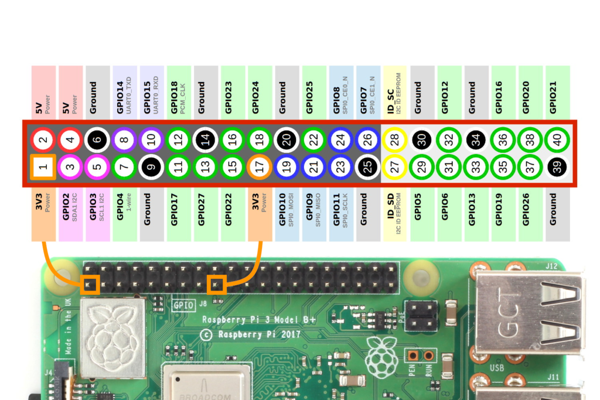

# Rotary Phone Audio Guestbook

This project transforms a rotary phone into a voice recorder for use at special events (i.e. wedding audio guestbook, etc.).


- [Rotary Phone Audio Guestbook](#rotary-phone-audio-guestbook)
  - [Background](#background)
  - [Materials](#materials)
  - [Setup](#setup)
    - [Prepare Your Rotary Phone](#prepare-your-rotary-phone)
    - [Download and Install the Custom Image](#download-and-install-the-custom-image)
    - [Configuration and Customization](#configuration-and-customization)
  - [Software](#software)
  - [Development](#development)
  - [Support](#support)
  - [Star History](#star-history)

## Background

Inspired by my own upcoming wedding, I created a DIY solution for an audio guestbook using a rotary phone. With most online rentals charging exorbitant fees without offering custom voicemail options, I sought a more affordable and customizable solution. Here, I've detailed a guide on creating your own audio guestbook. If you have questions, don't hesitate to reach out.

## [Materials](docs/materials.md)

## Setup

### Prepare Your Rotary Phone

- Follow the [Hardware](docs/hardware.md) section for detailed instructions on wiring your rotary phone to the Raspberry Pi.

_Note: This is a crucial first step before using the software._

### Download and Install the Custom Image

With your hardware ready, download the custom Raspberry Pi image provided, which has all necessary software pre-installed and pre-configured.

- Download the [latest release](https://github.com/nickpourazima/rotary-phone-audio-guestbook/releases)
- Extract the .gz file, i.e.: `gunzip rpizero_rotary_phone_audio_guestbook_v<latest>_imagebackup.img.gz`
- **Flash the Image to an SD Card**: Use a tool like the Raspberry Pi Imager or BalenaEtcher to flash the custom image onto your SD card:

  

- Customize the config to specify the following username/password:

  ```bash
    username: admin
    password: password
  ```

- Set up your wifi network accordingly

- **Insert and Boot**: Place the SD card into your Raspberry Pi and power it on to boot into the Rotary Phone Audio Guestbook.

### Configuration and Customization

Once your system is up and running, you will want to make adjustments to suit your specific setup, especially if your hardware differs or you have personal preferences for how the guestbook operates.

- [ ] Replace the voicemail.wav with your own custom recording
- [ ] Check your ALSA HW mapping

  Depending on your audio interface's configuration, you may need to adjust the ALSA settings further. If after running `aplay -l` you find that the ALSA hardware mapping differs from what is expected or if you're experiencing audio issues, consider modifying `.asoundrc` to ensure your device correctly identifies and uses your audio interface. For example, if your USB audio interface is listed as card 1, device 0, you might add or modify `.asoundrc` to include:

  ```bash
  pcm.!default {
      type hw
      card 1
  }

  ctl.!default {
      type hw
      card 1
  }
  ```

- [ ] Adjust the `config.yaml`

  This file allows you to customize your own set up (edit rpi GPIO pins, alsa mapping, etc), modify the yaml as necessary.

  - `alsa_hw_mapping`: The ALSA hardware mapping for your audio interface. Use aplay --help for format guidance.
  - `format`: Set the audio format (default is cd). Refer to aplay --help for options.
  - `file_type`: The type of file to save recordings as (default is wav).
  - `channels`: Number of audio channels (default is 2 for stereo).
  - `hook_gpio`: The GPIO pin connected to the phone's hook switch.

    - For GPIO mapping, refer to the wiring diagram specific to your rpi (i.e):

      

  - `hook_type`: Set to NC (Normally Closed) or NO (Normally Open), depending on your phone's hook switch hardware setup.
  - `recording_limit`: The maximum length for a recording in seconds (default is 300).
  - `sample_rate`: The sample rate for recordings (default is 44100 Hz).

  _Note: Adjust these settings as needed based on your specific hardware setup and preferences._

- [ ] Test audio playback/recording

To ensure your settings are correctly applied, you can test audio playback and recording after making changes. For playback, you can use a sample WAV file and the `aplay` command. For recording, `arecord` can be used followed by `aplay` to play back the recorded audio.

- [ ] Check [audioGuestBook systemctl service](audioGuestBook.service)

This service ensures smooth operation without manual intervention every time your Raspberry Pi boots up. The service file is sym linked to the `/etc/systemd/system` directory. Manual control of the service is possible as it operates as any other [`.service` entity](https://www.freedesktop.org/software/systemd/man/systemd.service.html). You can quickly check the status with `journalctl -u audioGuestBook.service`

## [Software](docs/software.md)

## [Development](docs/development.md)

## Support

It's great to see this project growing, special thanks to @svartis, @jmdevita, and @Mevel!

If this code helped you or if you have some feedback, I'd be happy to [hear about it](mailto:dillpicholas@duck.com)!
Feel like saying thanks? You can [buy me a coffee](https://ko-fi.com/dillpicholas)☕.

## Star History

<a href="https://star-history.com/#nickpourazima/rotary-phone-audio-guestbook&Date">
 <picture>
   <source media="(prefers-color-scheme: dark)" srcset="https://api.star-history.com/svg?repos=nickpourazima/rotary-phone-audio-guestbook&type=Date&theme=dark" />
   <source media="(prefers-color-scheme: light)" srcset="https://api.star-history.com/svg?repos=nickpourazima/rotary-phone-audio-guestbook&type=Date" />
   
 </picture>
</a>
