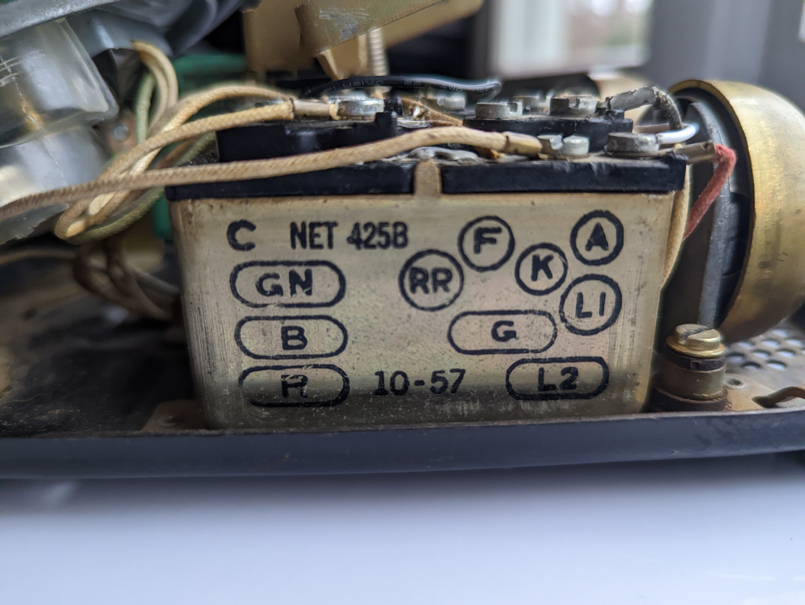
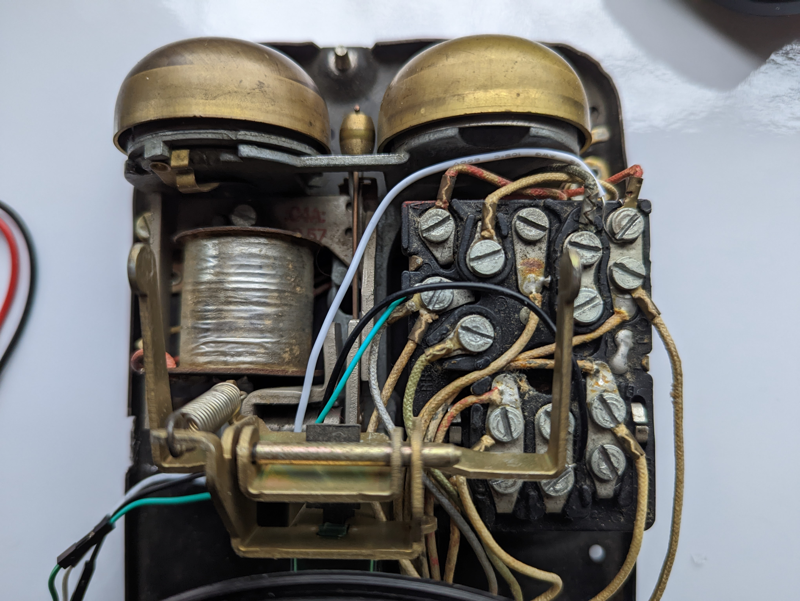

# Rotary Phone Audio Guestbook

- [Rotary Phone Audio Guestbook](#rotary-phone-audio-guestbook)
  - [Background](#background)
  - [Post-Event](#post-event)
    - [Future Work (Action Items)](#future-work-action-items)
  - [Materials](#materials)
  - [Hardware](#hardware)
    - [Wiring](#wiring)
      - [Hook](#hook)
      - [Phone Cord](#phone-cord)
    - [Microphone Replacement (Optional)](#microphone-replacement-optional)
  - [Software](#software)
    - [Dev Environment](#dev-environment)
    - [Installation](#installation)
    - [audioGuestBook systemctl service](#audioguestbook-systemctl-service)
    - [Config](#config)
    - [AudioInterface Class](#audiointerface-class)
    - [Operation Mode 1: audioGuestBook](#operation-mode-1-audioguestbook)
    - [Operation Mode 2: audioGuestBookwithRotaryDialer](#operation-mode-2-audioguestbookwithrotarydialer)
  - [Troubleshooting](#troubleshooting)
    - [Configuring Hook Type](#configuring-hook-type)
    - [Verify default audio interface](#verify-default-audio-interface)
      - [Check the Sound Card Configuration](#check-the-sound-card-configuration)
      - [Set the Default Sound Card](#set-the-default-sound-card)
      - [Restart ALSA](#restart-alsa)
  - [Support](#support)

This project transforms a rotary phone into a voice recorder for use at special events (i.e. wedding audio guestbook, etc.).


## Background

I was inspired by my own upcoming wedding to put together a DIY solution for an audio guestbook using a rotary phone. Most online rentals were charging $600 for an experience that didn't even offer the ability to add a custom voice mail and took about 4-6 weeks of turn around time to process the audio after the event. I tried to use as many parts that I had laying around to keep costs down. It worked out quite well and we were able to gather some very special voice messages.

Below you will find a parts list and detailed setup guide. Please feel free to reach out to me with any questions.

## Post-Event

Since this was a trial by fire type of scenario there ended up being a few gotchas at the real event which I've since accounted for. Namely setting a time limit on the recording length as we had some youngsters leaving 5+ minute messages repeatedly and this ended up draining the battery. Alternatively, depending on your scenario, it might be preferable to attach directly to a 5V power supply.

### Future Work (Action Items)

A few weeks before the wedding I had the code registering dialed numbers from the rotary encoder with the goal of playing back special messages for certain guests who dialed a certain combination (i.e. dial an area code to hear a special message to my old roomates). The details of this operation mode are described in [Mode 2](#operation-mode-2-audioguestbookwithrotarydialer) below. In order to activate this mode I had to wait for input when the phone was off the hook. This required an extra step of dialing zero before leaving a normal voice message. In the end we decided to keep it simple and I've thus migrated this code to the dev branch along with the code to run through post-processing the audio in a separate process.
If anyone is interested in expanding this please feel free.

I would also like to thread the audio playback so I can have a monitor/watchdog service terminate the thread upon hook callback so that the message doesn't continue playing once the user hangs up.

## Materials

| Part                                                                                                                                                                                                                                                                                                                                      | Notes                                                                                                                                                                                                 | Quantity | Cost         |
| ----------------------------------------------------------------------------------------------------------------------------------------------------------------------------------------------------------------------------------------------------------------------------------------------------------------------------------------- | ----------------------------------------------------------------------------------------------------------------------------------------------------------------------------------------------------- | -------- | ------------ |
| [rotary phone](https://www.ebay.com/b/Rotary-Dial-Telephone/38038/bn_55192308)                                                                                                                                                                                                                                                            | Estate/garage/yard sales are probably the best places to find once of these. Ideally one with a phone jack since we will be using these four wires extensively.                                       | 1        | $0.00-$60.00 |
| [raspberry pi zero](https://www.raspberrypi.com/products/raspberry-pi-zero/)                                                                                                                                                                                                                                                              | I didn't realize how hard these are to find these days. You can use any rpi or arduino style single-board computer but be aware of size constraints (i.e. must fit inside the rotary phone enclosure) | 1        | $9.99        |
| [raspberry pi zero case](https://www.adafruit.com/product/3252)                                                                                                                                                                                                                                                                           | Optional: added for protection. One of the cases on Amazon has a heat-sink cutout which might be nice for better heat dissapation since it will all be enclosed in the end.                           | 1        | $4.95        |
| [micro SD card](https://a.co/d/1gb2zhC)                                                                                                                                                                                                                                                                                                   | Any high capacity/throughput micro SD card that is rpi compatible                                                                                                                                     | 1        | $8.99        |
| [USB Audio Adapter](https://www.adafruit.com/product/1475)                                                                                                                                                                                                                                                                                | Note: I removed the external plastic shell and directly soldered the wires instead of using the female 3.5mm receptacle.                                                                              | 1        | $4.95        |
| [USB OTG Host Cable - MicroB OTG male to A female](https://www.adafruit.com/product/1099)                                                                                                                                                                                                                                                 |                                                                                                                                                                                                       | 1        | $2.50        |
| ---                                                                                                                                                                                                                                                                                                                                       | **--- If you don't want to solder anything ---**                                                                                                                                                      | ---      | ---          |
| [3.5mm Male to Screw Terminal Connector](https://www.parts-express.com/3.5mm-Male-to-Screw-Terminal-Connector-090-110?quantity=1&utm_source=google&utm_medium=cpc&utm_campaign=18395892906&utm_content=145242146127&gadid=623430178298&gclid=CjwKCAiAioifBhAXEiwApzCztl7aVb18WP4hDxnlQUCHsb62oIcnduFCSCbn9LFkZovYTQdr6omb3RoCD_gQAvD_BwE) | Optional: can connect the handset cables directly to the USB audio interface via these screw terminals                                                                                                | 2        | $1.37        |
| ---                                                                                                                                                                                                                                                                                                                                       | **--- If running off a battery ---**                                                                                                                                                                  | ---      | ---          |
| [LiPo Battery](https://www.adafruit.com/product/2011)                                                                                                                                                                                                                                                                                     | Optional: maximize capacity based on what will fit within your rotary enclosure.                                                                                                                      | 1        | $12.50       |
| [LiPo Shim](https://www.adafruit.com/product/3196)                                                                                                                                                                                                                                                                                        | Optional: if you plan to run this off a LiPo I would recommend something like this to interface with the rpi zero.                                                                                    | 1        | $9.95        |
| [LiPo Charger](https://www.adafruit.com/product/1904)                                                                                                                                                                                                                                                                                     | Optional: for re-charging the LiPo.                                                                                                                                                                   | 1        | $6.95        |
| ---                                                                                                                                                                                                                                                                                                                                       | **--- If replacing the built-it microphone ---**                                                                                                                                                      | ---      | ---          |
| [LavMic](https://www.amazon.com/dp/B01N6P80OQ?ref=nb_sb_ss_w_as-reorder-t1_ypp_rep_k3_1_9&amp=&crid=15WZEWMZ17EM9&amp=&sprefix=saramonic)                                                                                                                                                                                                 | Optional: if you'd like to replace the carbon microphone. This is an omnidirectional lavalier mic and outputs via a 3.5mm TRS                                                                         | 1        | $24.95       |

## Hardware

### Wiring

#### Hook

**Understanding Hook Types:** Depending on your rotary phone model, the hook switch may be Normally Closed (NC) or Normally Open (NO). When the phone is on the hook:

- NC: The circuit is closed (current flows).
- NO: The circuit is open (no current).

To accommodate either type, you'll need to update the `config.yaml` with the appropriate hook type setting.

- Use multimeter to do a continuity check to find out which pins control the hook:

| On-hook --> Open circuit (Value == 1) | Off-hook --> Current flowing     |
| ------------------------------------- | -------------------------------- |
|       |  |

- The B screw terminal on the rotary phone is connected to the black wire which is grounded to the rpi.
- The L2 screw terminal on the rotary phone is connected to the white wire which is connected to GPIO pin 22 on the rpi.

  

- _Note: the green wire was used for the experimental rotary encoder feature identified in the [future work](#future-work-action-items) section._

| Rotary Phone Block Terminal         | Top-down view                                |
| ----------------------------------- | -------------------------------------------- |
|  |  |

#### Phone Cord

- The wires from the handset cord need to be connected to the USB audio interface
  - I soldered it but you can alternatively use 2x [3.5mm Male to Screw Terminal Connector](https://www.parts-express.com/3.5mm-Male-to-Screw-Terminal-Connector-090-110?quantity=1&utm_source=google&utm_medium=cpc&utm_campaign=18395892906&utm_content=145242146127&gadid=623430178298&gclid=CjwKCAiAioifBhAXEiwApzCztl7aVb18WP4hDxnlQUCHsb62oIcnduFCSCbn9LFkZovYTQdr6omb3RoCD_gQAvD_BwE) which plug directly into the rpi.
    - _Note: The USB audio interface looks weird in the pics since I stripped the plastic shell off in order to solder directly to the mic/speaker leads_


- Use this ALSA command from the command line to test if the mic is working on the rpi before you set up the rotary phone: `aplay -l`
  - You might have a different hardware mapping than I did, in which case you would change the `alsa_hw_mapping` in the [config.yaml](config.yaml).
  - [Here's](https://superuser.com/questions/53957/what-do-alsa-devices-like-hw0-0-mean-how-do-i-figure-out-which-to-use) a good reference to device selection.
  - You can also check [this](https://stackoverflow.com/questions/32838279/getting-list-of-audio-input-devices-in-python) from Python.

### Microphone Replacement (Optional)

I found the sound quality of the built-in [carbon microphone](https://en.wikipedia.org/wiki/Carbon_microphone) on the rotary phone to be quite lacking in terms of amplitude, dynamic range and overall vocal quality. I tried boosting the gain from the digital (ALSA driver) side but this introduced an incredible amount of noise as expected. I then approached this from the analog domain and tried alternative circuitry to boost the sound quality based off this [carbon-to-dynamic converter](https://www.circuits-diy.com/mic-converter-circuit/).

Might be worth a further investigation in the future since it retains the integrity of the original rotary phone.

My final attempt involved the introduction of some post-proceesing (see dev branch) to bandpass some of the freqs outside the speech domain and add some normalization. The processing was costly in terms of processing and power consumption/rendering time and I ultimately decided it was worth acquiring something that yielded a better capture right out the gate. Crap in, crap out - as they say in the sound recording industry.

To replace:

- Unscrew mouthpiece and remove the carbon mic
- Pop out the plastic terminal housing with the two metal leads
- Unscrew red and black wires from terminal
- Prepare your lav mic
  - I pulled off the 3.5mm male headphone pin since it is usually coated and annoyingly difficult to solder directly on to.
  - Carefully separate the two wires from the lav mic and spiral up the surrounding copper. This will act as our ground signal.
- Extend the green wire from the phone cord clip to the ground point of the lav mic.
- Red to red, black to blue as per the following diagram:


## Software

### Dev Environment

- rpi image: [Rasbian](https://www.raspberrypi.com/documentation/computers/getting-started.html) w/ SSH enabled
- rpi on same network as development machine
- Desktop IDE: vscode w/ [SSH FS extension](https://marketplace.visualstudio.com/items?itemName=Kelvin.vscode-sshfs)

[Here's](https://jayproulx.medium.com/headless-raspberry-pi-zero-w-setup-with-ssh-and-wi-fi-8ddd8c4d2742) a great guide to get the rpi setup headless w/ SSH & WiFi dialed in.

### Installation

After cloning the repository, there's an installer script available to ease the setup process. This script takes care of several tasks:

1. Install required dependencies.
2. Replace placeholders in the service file to adapt to your project directory.
3. Move the modified service file to the systemd directory.
4. Create necessary directories (recordings and sounds).
5. Grant execution permissions to the Python scripts.
6. Reload systemd, enable, and start the service.

To run the installer, navigate to the project directory and execute:

```bash
chmod +x installer.sh
./installer.sh
```

### [audioGuestBook systemctl service](audioGuestBook.service)

The provided service ensures the Python script starts on boot. The installer script will place this service file in the `/etc/systemd/system`` directory and modify paths according to your project directory.

To manually control the service:

```sh
sudo systemctl enable audioGuestBook.service
sudo systemctl start audioGuestBook.service
```

This service ensures smooth operation without manual intervention every time your Raspberry Pi boots up.

### [Config](config.yaml)

- This file allows you to customize your own set up (edit rpi pins, audio reduction, alsa mapping, etc), modify the yaml as necessary.
- Ensure the sample rate is supported by your audio interface (default = 44100 Hz (decimal not required))
- For GPIO mapping, refer to the wiring diagram specific to your rpi:
  
- **hook_type**: Define your hook switch type here. Set it to "NC" if your phone uses a Normally Closed hook switch or "NO" for Normally Open.

### [AudioInterface Class](audioInterface.py)

- Utilizes pydub and pyaudio extensively.
- Houses the main playback/record logic and has future #TODO expansion for postprocessing the audio. Would like to test on an rpi4 to see if it can handle it better for real-time applications.

### Operation Mode 1: [audioGuestBook](/audioGuestBook.py)

- This is the main operation mode of the device.
- There are two callbacks in main which poll the gpio pins for the specified activity (hook depressed, hook released).
- In the code, depending on the `hook_type` set in the `config.yaml`, the software will adapt its behavior. For NC types, hanging up the phone will trigger the `on_hook` behavior, and lifting the phone will trigger the `off_hook` behavior. The opposite will be true for NO types.
- Once triggered the appropriate function is called.
- On hook (depressed)
  - Nothing happens
- Off hook (released)
  - Plays back your own welcome message located in `/sounds/voicemail.wav` followed by the beep indicating ready to record.
  - Begins recording the guests voice message.
  - Guest hangs up, recording is stopped and stored to the `/recordings/` directory.

### Operation Mode 2: [audioGuestBookwithRotaryDialer](./todo/audioGuestBookwithRotaryDialer.py)

**_Note_:** Untested - decided not to go this route for my own wedding

- This mode is a special modification of the normal operation and requires a slightly different wiring connection since it accepts input from the rotary dialer.
- The idea was to playback special messages when particular users dial a certain number combination (i.e. 909 would play back a message for certain guests who lived with the groom in that area code).
- In this mode of operation the users will need to dial 0 on the rotary dialer in order to initiate the voicemail.
- The rotary dialer is a bit more complex to set up, you need a pull up resistor connected between the F screw terminal and 5V on the rpi and the other end on GPIO 23. #TODO: Diagram

## Troubleshooting

### Configuring Hook Type

If you find that the behaviors for hanging up and lifting the phone are reversed, it's likely that the `hook_type` in `config.yaml` is incorrectly set. Ensure that it matches your phone's hook switch type (NC or NO).

### Verify default audio interface

A few users had issues where audio I/O was defaulting to HDMI. To alleviate this, check the following:

#### Check the Sound Card Configuration

Verify the available sound devices using the following command:

```bash
aplay -l
```

_Ensure that your USB audio interface is listed and note the card and device numbers._

#### Set the Default Sound Card

If you want to route audio through your USB audio interface, you'll need to make it the default sound card.
Edit the ALSA configuration file (usually located at `/etc/asound.conf` or `~/.asoundrc`) and add the following:

```bash
defaults.pcm.card X
defaults.ctl.card X
```

_Replace X with the card number of your USB audio interface obtained from the previous step._

#### Restart ALSA

```bash
sudo /etc/init.d/alsa-utils restart
```

## Support

If this code helped you or if you have some feedback, I'd be thrilled to [hear about it](mailto:dillpicholas@duck.com)!
Feel like saying thanks? You can [buy me a coffee](https://www.buymeacoffee.com/dillpicholas) ☕.
