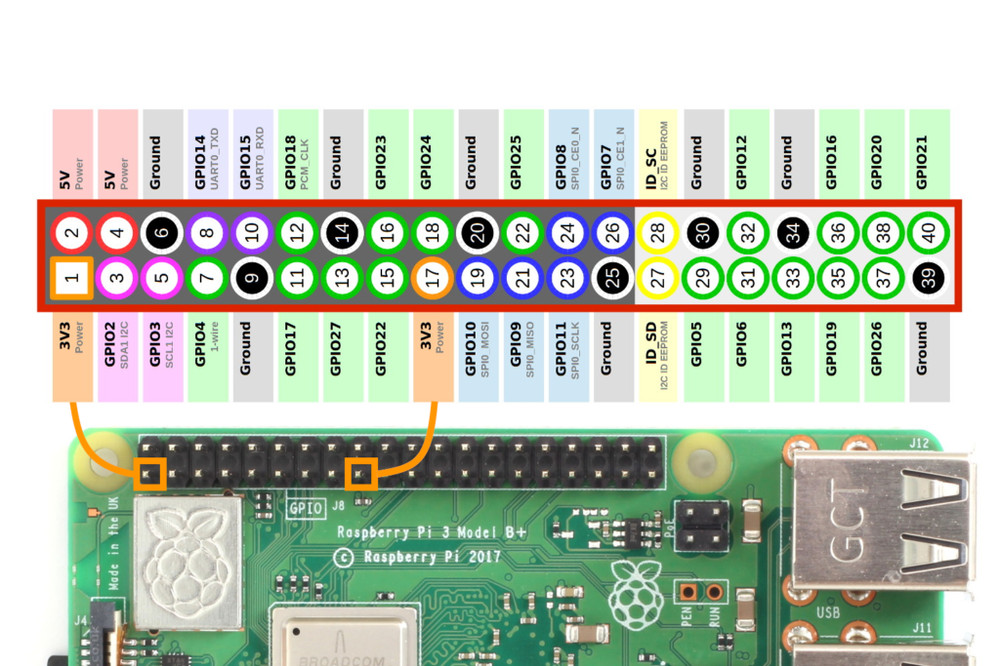

# Configuration Guide for Rotary Phone Audio Guestbook

This guide explains how to configure your Rotary Phone Audio Guestbook system to work with your specific hardware and customize it for your event.

## Initial Setup Checklist

- [ ] Replace the default greeting with your own custom recording
- [ ] Set the correct ALSA hardware mapping for your audio interface
- [ ] Configure the GPIO pins for your phone's hook switch
- [ ] Test audio playback and recording
- [ ] Verify the system service is running properly

## Audio Interface Configuration

### ALSA Hardware Mapping

Depending on your audio interface's configuration, you may need to adjust the ALSA settings. First, identify your audio devices by running:

```bash
aplay -l
```

This will list all available sound cards and digital audio devices. Look for your USB audio interface, noting its card and device numbers.

If your audio interface is not being detected correctly, you might need to modify `.asoundrc` in your home directory. For example, if your USB audio interface is listed as card 1, device 0, create or edit `.asoundrc` to include:

```bash
pcm.!default {
    type hw
    card 1
}

ctl.!default {
    type hw
    card 1
}
```

### Audio Format Settings

In `config.yaml`, you can customize audio format settings:

- `alsa_hw_mapping`: The ALSA hardware mapping for your audio interface (e.g., "plughw:1,0")
- `mixer_control_name`: The mixer control name to use for volume adjustment (e.g., "Speaker")
- `format`: Audio format to use (default is "cd" - see `aplay --help` for other options)
- `file_type`: Output file format (default is "wav")
- `channels`: Number of audio channels (2 for stereo, 1 for mono)
- `sample_rate`: Recording sample rate in Hz (default is 44100)

## GPIO Configuration

The Rotary Phone Audio Guestbook uses GPIO pins to detect when the phone handset is lifted or placed down, as well as for optional buttons.

### Hook Switch Configuration

The hook switch is the most critical configuration element, as it determines when recording starts and stops:

- `hook_gpio`: The GPIO pin number connected to the phone's hook switch
- `hook_type`: Set to "NC" (Normally Closed) or "NO" (Normally Open), depending on your phone's hook switch type
- `invert_hook`: Set to true if your hook behavior is reversed (recording starts when handset is down instead of up)
- `hook_bounce_time`: Debounce time in seconds to prevent false triggers (usually 0.1)

For GPIO pin mapping, refer to the wiring diagram specific to your Raspberry Pi model:



### Understanding Switch Types

- **NC (Normally Closed)**: When the handset is on the hook (resting), the circuit is CLOSED. When lifted, the circuit OPENS.
- **NO (Normally Open)**: When the handset is on the hook (resting), the circuit is OPEN. When lifted, the circuit CLOSES.

Most older rotary phones use NC switches, but some models vary. If you're unsure, you can test with a multimeter or try both settings.

### Troubleshooting Hook Configuration

If you experience issues with your hook behavior:

1. First, identify your switch type (NO or NC):

   - NC (Normally Closed): The switch completes the circuit when not pressed
   - NO (Normally Open): The switch completes the circuit when pressed

2. Set `hook_type` according to your physical switch type

3. If the behavior is still reversed (e.g., recording when handset is down), set `invert_hook: true`

4. If the hook is triggering erratically, increase the `hook_bounce_time` from 0.1 to 0.2 or 0.3 seconds

5. After any configuration change, restart the service: `sudo systemctl restart audioGuestBook.service`

### Common Hook Switch Issues

- **System not responding to handset lifts**: Check the GPIO pin number and wire connections
- **Recording starts when handset is down**: Set `invert_hook: true` in config.yaml
- **Multiple recordings triggered when lifting/placing handset**: Increase `hook_bounce_time` to 0.2 or 0.3
- **System crashes with rapid hook toggles**: Update to the latest software version which includes race condition handling

### Other GPIO Settings

- `record_greeting_gpio`: GPIO pin for the button to record a new greeting (set to 0 to disable)
- `record_greeting_type`: "NC" or "NO" for the record greeting button
- `record_greeting_bounce_time`: Debounce time for the greeting button
- `shutdown_gpio`: GPIO pin for a shutdown button (set to 0 to disable)
- `shutdown_button_hold_time`: Time in seconds to hold the shutdown button (default is 2)

## Audio Files Configuration

### Greeting Message

- `greeting`: Path to the greeting audio file
- `greeting_volume`: Volume level for the greeting (0.0 to 1.0)
- `greeting_start_delay`: Delay in seconds before playing the greeting

#### Recording a Custom Greeting

To record a custom greeting:

1. Connect a microphone to your Raspberry Pi
2. If you've configured a record_greeting button, press and hold it to record your message
3. Alternatively, you can record on another device and copy the WAV file to `/home/admin/rotary-phone-audio-guestbook/sounds/greeting.wav`

### Beep Sound

- `beep`: Path to the beep audio file
- `beep_volume`: Volume level for the beep
- `beep_start_delay`: Delay in seconds before playing the beep
- `beep_include_in_message`: Whether to include the beep in the recorded message (true or false)

### Time Exceeded Message

- `time_exceeded`: Path to the time exceeded audio file
- `time_exceeded_volume`: Volume level for the time exceeded message

## Recording Settings

- `recordings_path`: Directory where recordings will be saved
- `recording_limit`: Maximum recording length in seconds
- `time_exceeded_length`: Time in seconds after which the time exceeded message plays

## System Service

The audioGuestBook.service ensures the application runs automatically at system startup.

You can control the service with these commands:

```bash
# Start the service
sudo systemctl start audioGuestBook.service

# Stop the service
sudo systemctl stop audioGuestBook.service

# Restart the service (after configuration changes)
sudo systemctl restart audioGuestBook.service

# Check service status
sudo systemctl status audioGuestBook.service

# View service logs
journalctl -u audioGuestBook.service
```

### Troubleshooting Service Issues

If the service fails to start:

1. Check the logs for errors:

   ```bash
   journalctl -u audioGuestBook.service -n 50 --no-pager
   ```

2. Verify config.yaml is correctly formatted:

   ```bash
   cd /home/admin/rotary-phone-audio-guestbook
   python3 -c "import yaml; yaml.safe_load(open('config.yaml'))"
   ```

3. Check permissions on audio devices:
   ```bash
   ls -la /dev/snd/
   sudo usermod -a -G audio admin
   ```

## Complete Config.yaml Example

```yaml
alsa_hw_mapping: plughw:1,0
mixer_control_name: Speaker # look at amixer scontrols for available controls
format: cd # look at aplay --help for available formats
file_type: wav
channels: 2
hook_gpio: 22
hook_type: NO # or 'NC' depending on your hardware configuration
invert_hook: true # Set to true if your hook behavior is reversed (recording starts when handset is down instead of up)
# Software bounce compensation this is the length of time (in seconds) that the component will ignore changes in state after an initial change.
hook_bounce_time: 0.1 # float or None
recording_limit: 300
sample_rate: 44100

# Record greeting message button (Set to 0 to skip setup of this feature)
record_greeting_gpio: 23
record_greeting_type: NC # or 'NO' depending on your hardware configuration
# Software bounce compensation this is the length of time (in seconds) that the component will ignore changes in state after an initial change.
record_greeting_bounce_time: 0.1 # float or None

# The beep sound is played when the user picks up the phone
beep: /home/admin/rotary-phone-audio-guestbook/sounds/beep.wav
beep_volume: 1.0
beep_start_delay: 0.0
beep_include_in_message: true

# The greeting sound is played when the user picks up the phone
greeting: /home/admin/rotary-phone-audio-guestbook/sounds/greeting.wav
greeting_volume: 1.0
greeting_start_delay: 1.5

# The time_exceeded sound is played when the user has been recording for too long
time_exceeded: /home/admin/rotary-phone-audio-guestbook/sounds/time_exceeded.wav
time_exceeded_volume: 1.0

recordings_path: /home/admin/rotary-phone-audio-guestbook/recordings
time_exceeded_length: 300

shutdown_gpio: 0 #Set GPIO pin here --> Note: Pin is active LOW, pull Pin to GND to activate shutdown
shutdown_button_hold_time: 2 # default 2 seconds
```

## Testing Your Configuration

After making changes to your configuration:

1. Restart the service: `sudo systemctl restart audioGuestBook.service`
2. Check the logs for any errors: `journalctl -u audioGuestBook.service -f`
3. Test audio playback:

   ```bash
   aplay -D plughw:1,0 /path/to/test.wav
   ```

4. Test audio recording:

   ```bash
   arecord -D plughw:1,0 -f cd -d 5 test.wav
   aplay -D plughw:1,0 test.wav
   ```

5. Test the phone hook by lifting and replacing the handset

## Web Interface

You can also configure your Rotary Phone Audio Guestbook through the web interface, which provides a user-friendly way to modify settings and manage recordings.

Access the web interface by navigating to your Raspberry Pi's IP address and port 8080 in a web browser: `http://your_raspberry_pi_ip:8080`

Changes should be applied automatically through the web interface, if that isn't the case then you can manually restart the systemctl service.

## Performance Optimization

If you're planning to use the guestbook for a long event, consider these tips:

1. **Monitor disk space**: Recordings can accumulate quickly. Check available space with:

   ```bash
   df -h
   ```

2. **Enable automatic cleanup**: If disk space is an issue, you can set up a cron job to archive or delete older recordings.

3. **Cooling**: Ensure proper ventilation for your Raspberry Pi, especially if the event is in a warm environment.

## Backup and Recovery

To backup your recordings:

1. Use the web interface to download recordings
2. Or, use `scp` to copy recordings to another computer:

   ```bash
   scp -r admin@your_raspberry_pi_ip:/home/admin/rotary-phone-audio-guestbook/recordings /path/to/backup
   ```

3. Backup your custom configuration:
   ```bash
   scp admin@your_raspberry_pi_ip:/home/admin/rotary-phone-audio-guestbook/config.yaml /path/to/backup
   ```
