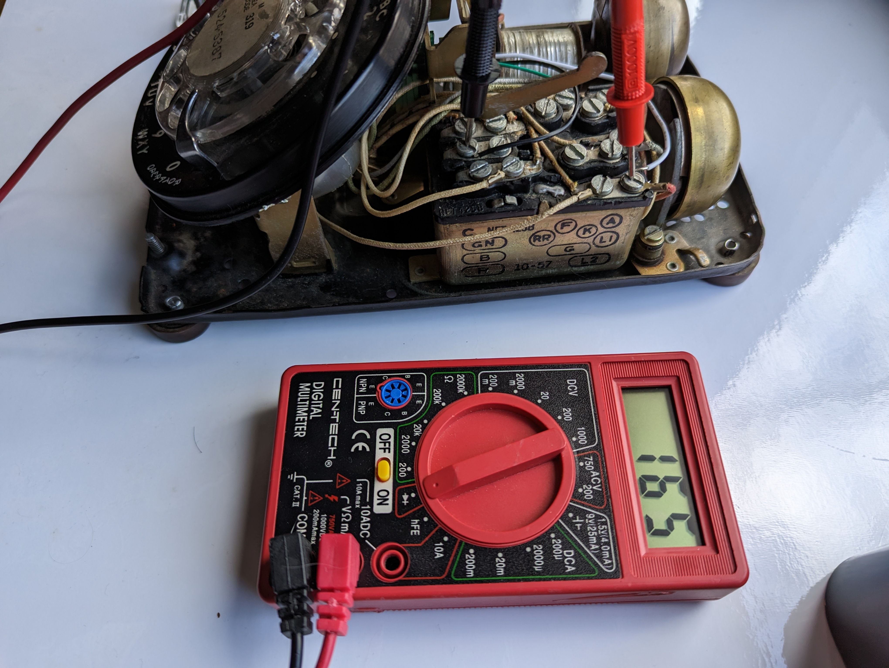

# Hardware

## Wiring

### Hook

**Understanding Hook Types:** Depending on your rotary phone model, the hook switch may be Normally Closed (NC) or Normally Open (NO). When the phone is on the hook:

- NC: The circuit is closed (current flows).
- NO: The circuit is open (no current).

To accommodate either type, you'll need to update the `config.yaml` with the appropriate hook type setting.

- Use multimeter to do a continuity check to find out which pins control the hook:

| On-hook --> Open circuit (Value == 1) | Off-hook --> Current flowing     |
| ------------------------------------- | -------------------------------- |
|       |  |

- The B screw terminal on the rotary phone is connected to the black wire which is grounded to the rpi.
- The L2 screw terminal on the rotary phone is connected to the white wire which is connected to GPIO pin 22 on the rpi.

  

- _Note: the green wire was used for the experimental rotary encoder feature identified in the [future work](#future-enhancements) section._

| Rotary Phone Block Terminal         | Top-down view                                |
| ----------------------------------- | -------------------------------------------- |
|  |  |

### Phone Cord

- The wires from the handset cord need to be connected to the USB audio interface
  - I soldered it but you can alternatively use 2x [3.5mm Male to Screw Terminal Connector](https://www.parts-express.com/3.5mm-Male-to-Screw-Terminal-Connector-090-110?quantity=1&utm_source=google&utm_medium=cpc&utm_campaign=18395892906&utm_content=145242146127&gadid=623430178298&gclid=CjwKCAiAioifBhAXEiwApzCztl7aVb18WP4hDxnlQUCHsb62oIcnduFCSCbn9LFkZovYTQdr6omb3RoCD_gQAvD_BwE) which plug directly into the rpi.
    - _Note: The USB audio interface looks weird in the pics since I stripped the plastic shell off in order to solder directly to the mic/speaker leads_

- Use this ALSA command from the command line to test if the mic is working on the rpi before you set up the rotary phone: `aplay -l`
  - You might have a different hardware mapping than I did, in which case you would change the `alsa_hw_mapping` in the [config.yaml](../config.yaml).
  - [Here's](https://superuser.com/questions/53957/what-do-alsa-devices-like-hw0-0-mean-how-do-i-figure-out-which-to-use) a good reference to device selection.
  - You can also check [this](https://stackoverflow.com/questions/32838279/getting-list-of-audio-input-devices-in-python) from Python.

## Optional: Microphone Replacement

For improved sound quality, consider replacing the built-in [carbon microphone](https://en.wikipedia.org/wiki/Carbon_microphone).

I found the sound quality of the built-in mic on the rotary phone to be quite lacking in terms of amplitude, dynamic range and overall vocal quality. I tried boosting the gain from the digital (ALSA driver) side but this introduced an incredible amount of noise as expected. I then approached this from the analog domain and tried alternative circuitry to boost the sound quality based off this [carbon-to-dynamic converter](https://www.circuits-diy.com/mic-converter-circuit/).

Might be worth a further investigation in the future since it retains the integrity of the original rotary phone.

My final attempt involved the introduction of some post-proceesing (see dev branch) to bandpass some of the freqs outside the speech domain and add some normalization. The processing was costly in terms of processing and power consumption/rendering time and I ultimately decided it was worth acquiring something that yielded a better capture right out the gate. Crap in, crap out - as they say in the sound recording industry.

To replace:

- Unscrew mouthpiece and remove the carbon mic
- Pop out the plastic terminal housing with the two metal leads
- Unscrew red and black wires from terminal
- Prepare your lav mic
  - I pulled off the 3.5mm male headphone pin since it is usually coated and annoyingly difficult to solder directly on to.
  - Carefully separate the two wires from the lav mic and spiral up the surrounding copper. This will act as our ground signal.
- Extend the green wire from the phone cord clip to the ground point of the lav mic.
- Red to red, black to blue as per the following diagram:

