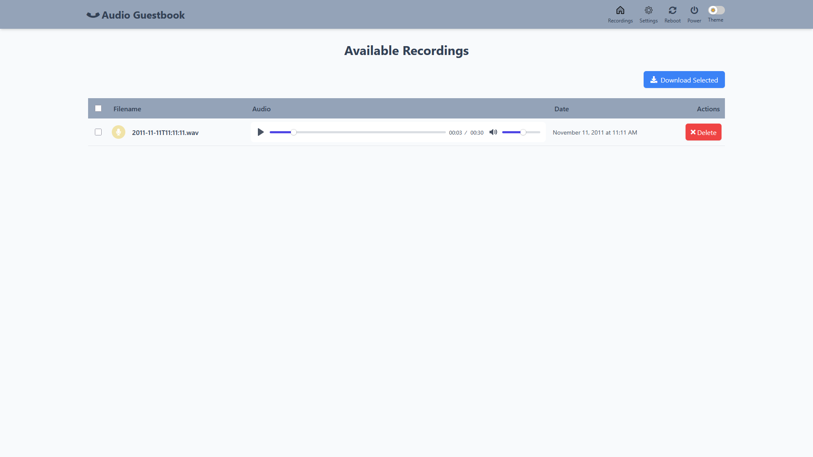

# Software

## [audioInterface](../src/audioInterface.py)

- Utilizes ALSAs native aplay/arecord via subprocess calls.
- Houses the main playback/record logic.

## [audioGuestBook](../src/audioGuestBook.py)

- This is the main operation mode of the device.
- There are two callbacks in main which poll the gpio pins for the specified activity (hook depressed, hook released).
- In the code, depending on the `hook_type` set in the `config.yaml`, the software will adapt its behavior. For NC types, hanging up the phone will trigger the `on_hook` behavior, and lifting the phone will trigger the `off_hook` behavior. The opposite will be true for NO types.
- Once triggered the appropriate function is called.
- On hook (depressed)
  - Nothing happens
- Off hook (released)
  - Plays back your own added welcome message located in `/sounds/voicemail.wav` followed by the [beep](../sounds/beep.wav) indicating the start of recording.
  - Begins recording the guests voice message.
  - Guest hangs up, recording is stopped and stored to the `/recordings/` directory.
  - If the guest exceeds the **recording_limit** specified in the [config.yaml](../config.yaml), play the warning [time_exceeded.wav](../sounds/time_exceeded.wav) sound and stop recording.

## [Web Server](../webserver/server.py)

- A lightweight web server that runs locally on your network running on port 8000.
- The web page can be accessed by finding the raspberry pi's ip address, and with port 8000 (example: 192.168.1.100:8000) on any device on the same network.
- The page will dynamically pull any recording stored in the `/recordings/` directory into a list, and will be updated by refreshing your browser.
- A fully built .service file can be run automatically in addition to the audioGuestBook. Make sure to copy and paste this service to `/etc/systemd/system` to be able to run it with systemctl.

**UPDATE**:

  As of [release **v1.0.2**](https://github.com/nickpourazima/rotary-phone-audio-guestbook/releases/tag/v1.0.2) the webserver has been updated with a modern interface using Tailwind CSS to ensure responsiveness and better visual clarity.

  New features include:

- Ability to edit recorded file names directly from the web interface.
- Bulk/individual/selectable recorded file downloads.
- Playback recorded files directly on the webserver.
- Delete recordings.

- All `config.yaml` params are configurable from the settings page.

- Dark/light themes.

